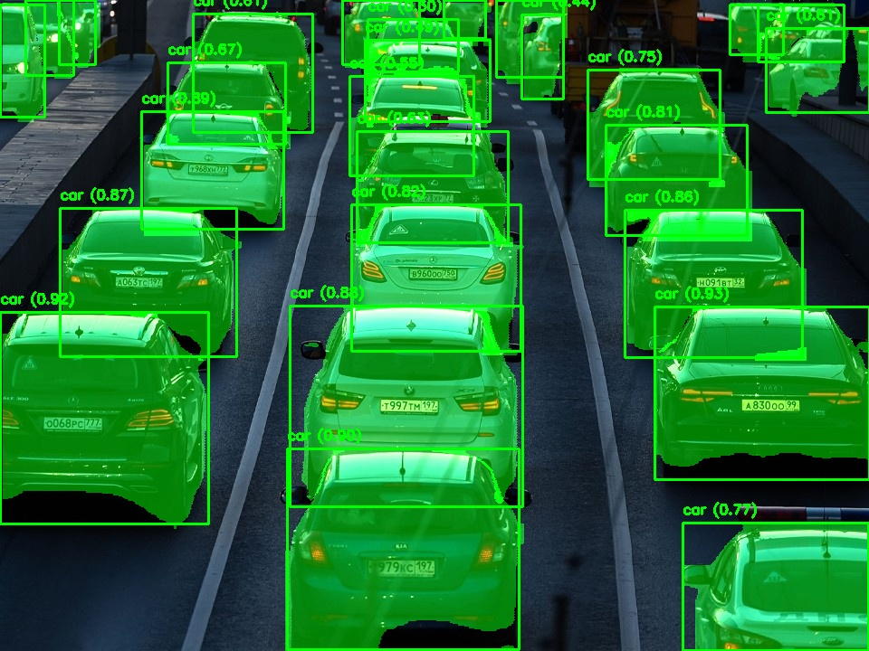

# Курсовая работа по CV

## Задача и данные

В качестве задачи была выбрана задача сегментации изображений, в качестве объектов - транспортные средства.

## Как запустить?

1. Клонируйте репозиторий:
```
git clone https://github.com/lassiezfaire/ai-technologies-term-paper.git
cd ai-technologies-term-paper
```
2. Установите зависимости: 
```
conda env create -f environment.yml
``` 
3. Запустите, написав в Терминале:
```
python -m uvicorn app:app --reload
```
4. Сервер заработает по ссылке http://127.0.0.1:8000/.

## Пример работы:



